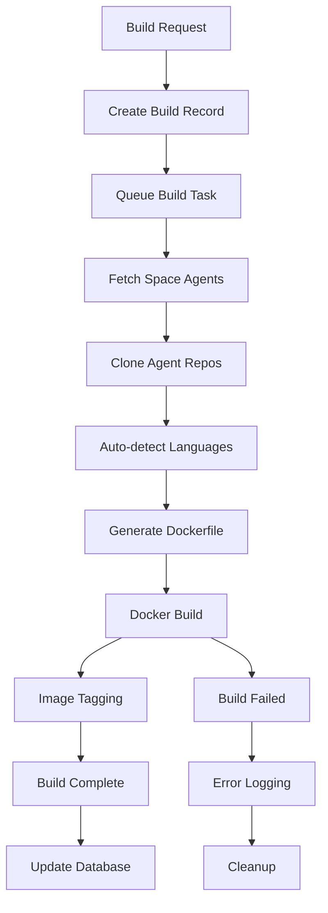

# Space Build System

The Space Build System is Raworc's innovative approach to agent deployment, using a pre-compilation strategy where agents are built into immutable Docker images rather than built at runtime. This design ensures fast session startup, consistent environments, and enterprise-grade reliability.

## Overview

### Build vs Runtime Separation

**Traditional Approach (Slower):**
```
Session Start → Clone Repos → Install Dependencies → Compile Code → Execute
     ↑                                    ↑
  ~30-60 seconds                    Inconsistent environments
```

**Raworc Approach (Faster):**
```
Build Time: Space Build → Clone Repos → Install Dependencies → Compile Code → Create Image
Runtime:    Session Start → Use Pre-built Image → Execute
                ↑
          ~10-15 seconds with consistent environment
```

### Key Benefits

1. **Fast Session Startup**: Pre-built agents eliminate compilation overhead
2. **Immutable Deployments**: Each build creates a tagged, traceable image
3. **Consistent Environments**: Identical runtime across all sessions
4. **Enterprise Security**: Build-time scanning and validation
5. **Scalability**: Session containers only execute, never build

## Architecture

### Build Pipeline Components

```
┌─────────────────┐    ┌─────────────────┐    ┌─────────────────┐
│   API Server    │────│     Build       │────│  Docker Engine  │
│ (Build Trigger) │    │   Manager       │    │ (Image Creation)│
└─────────────────┘    └─────────────────┘    └─────────────────┘
         │                       │                       │
         └─────────────────────────┼───────────────────────┘
                                 │
                    ┌─────────────────┐
                    │     MySQL       │
                    │ (Build Metadata)│
                    └─────────────────┘
```

**Components:**
- **Build Manager** (`build_manager.rs`): Orchestrates build process
- **Space Builder** (`space_builder.rs`): Handles agent compilation
- **Docker Manager** (`docker_manager.rs`): Manages container operations
- **Task Queue**: MySQL-backed build job processing

### Build Lifecycle



## Build Process Implementation

### 1. Build Initiation

**CLI Trigger:**
```bash
raworc api spaces/default/build -m post
```

**Database Record Creation:**
```rust
async fn create_build_record(&self, space: &str, forced: bool) -> Result<String> {
    let build_id = Uuid::new_v4().to_string();
    
    sqlx::query!(r#"
        INSERT INTO space_builds (
            build_id, space, status, created_at, forced, created_by
        ) VALUES (?, ?, 'pending', NOW(), ?, ?)
    "#, build_id, space, forced, created_by)
    .execute(&self.pool).await?;
    
    // Queue build task
    sqlx::query!(r#"
        INSERT INTO build_tasks (
            build_id, task_type, status, created_at
        ) VALUES (?, 'build_space', 'pending', NOW())
    "#, build_id)
    .execute(&self.pool).await?;
    
    Ok(build_id)
}
```

### 2. Agent Repository Processing

**Agent Fetching:**
```rust
async fn fetch_space_agents(&self, space: &str) -> Result<Vec<AgentData>> {
    let agents = sqlx::query!(r#"
        SELECT name, description, purpose, source_repo, source_branch, 
               metadata, created_at, created_by
        FROM space_agents 
        WHERE space = ? AND deleted_at IS NULL
        ORDER BY created_at ASC
    "#, space).fetch_all(&self.pool).await?;
    
    Ok(agents.into_iter().map(|row| AgentData {
        name: row.name,
        description: row.description,
        purpose: row.purpose,
        source_repo: row.source_repo,
        source_branch: row.source_branch.unwrap_or_else(|| "main".to_string()),
        metadata: serde_json::from_str(&row.metadata).unwrap_or_default(),
    }).collect())
}
```

**Repository Cloning:**
```rust
async fn clone_agent_repo(&self, repo: &str, branch: &str, target_dir: &Path) -> Result<()> {
    let clone_url = if repo.starts_with("http") {
        repo.to_string()
    } else {
        format!("https://github.com/{}", repo)
    };
    
    let output = Command::new("git")
        .args(&["clone", "--branch", branch, "--depth", "1", &clone_url, &target_dir.to_string_lossy()])
        .output()?;
    
    if !output.status.success() {
        return Err(anyhow::anyhow!("Git clone failed: {}", String::from_utf8_lossy(&output.stderr)));
    }
    
    // Remove .git directory to reduce image size
    let git_dir = target_dir.join(".git");
    if git_dir.exists() {
        std::fs::remove_dir_all(git_dir)?;
    }
    
    Ok(())
}
```

### 3. Language Detection & Build Instructions

**Auto-detection Logic:**
```rust
async fn generate_build_instructions(&self, agents_dir: &Path) -> Result<String> {
    let mut build_commands = Vec::new();
    
    // Process each agent directory
    for entry in std::fs::read_dir(agents_dir)? {
        let agent_dir = entry?.path();
        if !agent_dir.is_dir() { continue; }
        
        let cargo_toml = agent_dir.join("Cargo.toml");
        let requirements_txt = agent_dir.join("requirements.txt");
        let package_json = agent_dir.join("package.json");
        
        if cargo_toml.exists() {
            // Rust project
            build_commands.push(format!(r#"
                cd {} && \
                sudo -u host cargo build --release
            "#, agent_dir.file_name().unwrap().to_string_lossy()));
            
        } else if requirements_txt.exists() {
            // Python project
            build_commands.push(format!(r#"
                cd {} && \
                if sudo -u host python3 -m venv venv 2>/dev/null && [ -x "./venv/bin/pip" ]; then \
                    echo "    -> Using virtual environment"; \
                    sudo -u host ./venv/bin/pip install -r requirements.txt; \
                else \
                    echo "    -> Virtual environment failed, using global pip with --break-system-packages"; \
                    sudo -u host pip3 install -r requirements.txt --break-system-packages; \
                fi
            "#, agent_dir.file_name().unwrap().to_string_lossy()));
            
        } else if package_json.exists() {
            // Node.js project
            build_commands.push(format!(r#"
                cd {} && \
                sudo -u host npm install
            "#, agent_dir.file_name().unwrap().to_string_lossy()));
        }
    }
    
    Ok(build_commands.join(" && "))
}
```

### 4. Dockerfile Generation

**Dynamic Dockerfile Creation:**
```rust
async fn generate_dockerfile(&self, base_image_id: &str, space: &str, build_commands: &str) -> Result<String> {
    let dockerfile_content = format!(r#"
# Use local base image by ID to prevent Docker Hub pulls
FROM {}

# Set space identifier
ENV RAWORC_SPACE_ID={}

# Copy agents directory with proper ownership
COPY --chown=host:host agents/ /session/agents/

# Build all agents with language-specific commands
RUN cd /session/agents && {}

# Ensure proper permissions
RUN chown -R host:host /session/agents && \
    chmod -R 755 /session/agents

# Set working directory
WORKDIR /session

# Use same entrypoint as base image
"#, base_image_id, space, build_commands);

    Ok(dockerfile_content)
}
```

### 5. Docker Build Execution

**Build Process:**
```rust
async fn execute_docker_build(&self, context_dir: &Path, dockerfile_content: &str, build_id: &str, space: &str) -> Result<String> {
    // Write Dockerfile
    let dockerfile_path = context_dir.join("Dockerfile");
    tokio::fs::write(&dockerfile_path, dockerfile_content).await?;
    
    // Create build options
    let image_tag = format!("raworc_space_{}:{}", space, build_id);
    let build_options = bollard::image::BuildImageOptions {
        dockerfile: "Dockerfile".to_string(),
        t: image_tag.clone(),
        rm: true,
        forcerm: true,
        pull: false,  // Use local images only
        ..Default::default()
    };
    
    // Create tar context
    let tar_context = self.create_tar_context(context_dir).await?;
    
    // Execute build with timeout
    let timeout = Duration::from_secs(600); // 10 minutes
    let build_stream = self.docker.build_image(build_options, None, Some(tar_context));
    
    let mut stream = build_stream.timeout(timeout);
    
    while let Ok(Some(result)) = stream.next().await {
        match result {
            Ok(output) => {
                if let Some(stream) = output.stream {
                    info!("Build output: {}", stream.trim());
                }
                if let Some(error) = output.error {
                    return Err(anyhow::anyhow!("Docker build error: {}", error));
                }
            }
            Err(e) => {
                return Err(anyhow::anyhow!("Docker build stream error: {}", e));
            }
        }
    }
    
    // Verify image was created
    self.verify_image_exists(&image_tag).await?;
    
    Ok(image_tag)
}
```

### 6. Build Status Tracking

**Status Updates:**
```rust
async fn update_build_status(&self, build_id: &str, status: &str, error: Option<&str>) -> Result<()> {
    if let Some(error_msg) = error {
        sqlx::query!(r#"
            UPDATE space_builds 
            SET status = ?, completed_at = NOW(), error = ?
            WHERE build_id = ?
        "#, status, error_msg, build_id)
        .execute(&self.pool).await?;
    } else {
        sqlx::query!(r#"
            UPDATE space_builds 
            SET status = ?, completed_at = NOW()
            WHERE build_id = ?
        "#, status, build_id)
        .execute(&self.pool).await?;
    }
    
    Ok(())
}
```

## Build Task Queue

### Task Processing

**Build Task Types:**
```rust
#[derive(Debug, Clone, Serialize, Deserialize)]
pub enum BuildTaskType {
    BuildSpace,      // Build complete space image
    CleanupBuild,    // Clean up failed build artifacts
    PruneImages,     // Remove old space images
}
```

**Task Queue Management:**
```rust
async fn process_build_tasks(&self) -> Result<()> {
    loop {
        // Get next pending task with lock
        let task = sqlx::query_as!(BuildTask, r#"
            SELECT * FROM build_tasks 
            WHERE status = 'pending' 
            ORDER BY created_at ASC 
            LIMIT 1 
            FOR UPDATE
        "#).fetch_optional(&self.pool).await?;
        
        if let Some(task) = task {
            // Mark as processing
            sqlx::query!(r#"
                UPDATE build_tasks 
                SET status = 'processing', started_at = NOW()
                WHERE id = ?
            "#, task.id).execute(&self.pool).await?;
            
            // Process task
            let result = self.handle_build_task(task.clone()).await;
            
            // Update task status
            match result {
                Ok(_) => {
                    sqlx::query!(r#"
                        UPDATE build_tasks 
                        SET status = 'completed', completed_at = NOW()
                        WHERE id = ?
                    "#, task.id).execute(&self.pool).await?;
                }
                Err(e) => {
                    sqlx::query!(r#"
                        UPDATE build_tasks 
                        SET status = 'failed', completed_at = NOW(), error = ?
                        WHERE id = ?
                    "#, e.to_string(), task.id).execute(&self.pool).await?;
                }
            }
        } else {
            // No pending tasks, wait before checking again
            tokio::time::sleep(Duration::from_secs(5)).await;
        }
    }
}
```

## Build Triggers

### Automatic Build Triggers

**Agent Addition/Modification:**
```rust
async fn handle_agent_change(&self, space: &str, agent_name: &str) -> Result<()> {
    // Check if space build is needed
    let last_build = self.get_latest_build_time(space).await?;
    let agent_modified = self.get_agent_modified_time(space, agent_name).await?;
    
    if agent_modified > last_build {
        info!("Agent {} modified after last build, triggering space build", agent_name);
        self.trigger_space_build(space, false).await?;
    }
    
    Ok(())
}
```

**Force Build Option:**
```rust
async fn trigger_space_build(&self, space: &str, force: bool) -> Result<String> {
    if !force {
        // Check if build is needed
        let needs_build = self.check_build_needed(space).await?;
        if !needs_build {
            return Err(anyhow::anyhow!("Space build not needed, use force=true to rebuild"));
        }
    }
    
    let build_id = self.create_build_record(space, force).await?;
    info!("Triggered space build for {} with build_id {}", space, build_id);
    
    Ok(build_id)
}
```

### Manual Build Triggers

**CLI Request:**
```bash
# Force build regardless of changes
raworc api spaces/default/build -m post -b '{"force": true}'

# Build only if needed
raworc api spaces/default/build -m post
```

**API Response:**
```json
{
  "build_id": "f47ac10b-58cc-4372-a567-0e02b2c3d479",
  "space": "default",
  "status": "pending",
  "forced": true,
  "created_at": "2025-08-21T10:00:00Z",
  "created_by": "admin"
}
```

## Image Management

### Image Naming Convention

**Space Images:**
```
raworc_space_{space_name}:{build_id}
```

**Examples:**
- `raworc_space_default:f47ac10b-58cc-4372-a567-0e02b2c3d479`
- `raworc_space_production:2a3b4c5d-6e7f-8901-2345-6789abcdef01`
- `raworc_space_staging:3c4d5e6f-7890-1234-5678-90abcdef0123`

### Image Lifecycle

**Creation:**
```rust
async fn create_space_image(&self, space: &str, build_id: &str) -> Result<String> {
    let image_tag = format!("raworc_space_{}:{}", space, build_id);
    
    // Build image (implementation above)
    let result = self.execute_docker_build(context_dir, dockerfile, build_id, space).await?;
    
    // Tag as latest for space
    let latest_tag = format!("raworc_space_{}:latest", space);
    self.docker.tag_image(&image_tag, Some(&latest_tag)).await?;
    
    Ok(image_tag)
}
```

**Cleanup:**
```rust
async fn cleanup_old_images(&self, space: &str, keep_count: usize) -> Result<()> {
    // Get all images for space, ordered by creation time
    let images = self.list_space_images(space).await?;
    
    // Keep the most recent `keep_count` images
    if images.len() > keep_count {
        let to_remove = &images[keep_count..];
        
        for image in to_remove {
            info!("Removing old space image: {}", image.tag);
            self.docker.remove_image(image.tag, None, None).await?;
        }
    }
    
    Ok(())
}
```

## Build Monitoring

### Build Status Tracking

**Database Schema:**
```sql
CREATE TABLE space_builds (
    build_id VARCHAR(36) PRIMARY KEY,
    space VARCHAR(255) NOT NULL,
    status ENUM('pending', 'building', 'completed', 'failed') NOT NULL,
    image_tag VARCHAR(255),
    created_at TIMESTAMP NOT NULL DEFAULT CURRENT_TIMESTAMP,
    started_at TIMESTAMP NULL,
    completed_at TIMESTAMP NULL,
    forced BOOLEAN NOT NULL DEFAULT FALSE,
    created_by VARCHAR(255) NOT NULL,
    error TEXT,
    metadata JSON,
    INDEX idx_space_builds_space (space),
    INDEX idx_space_builds_status (status),
    INDEX idx_space_builds_created_at (created_at),
    CONSTRAINT fk_space_builds_space FOREIGN KEY (space) REFERENCES spaces(name) ON DELETE CASCADE
);
```

**Build Status API:**
```bash
# Get latest build status
raworc api spaces/default/build/latest

# Get specific build status  
raworc api spaces/default/build/{build_id}

# List all builds for space
raworc api spaces/default/build
```

**Response Example:**
```json
{
  "build_id": "f47ac10b-58cc-4372-a567-0e02b2c3d479",
  "space": "default",
  "status": "completed",
  "image_tag": "raworc_space_default:f47ac10b-58cc-4372-a567-0e02b2c3d479",
  "created_at": "2025-08-21T10:00:00Z",
  "started_at": "2025-08-21T10:00:05Z",
  "completed_at": "2025-08-21T10:02:30Z",
  "duration_seconds": 145,
  "forced": false,
  "created_by": "admin",
  "agents_built": [
    {
      "name": "python-agent",
      "runtime": "python",
      "build_time_seconds": 45
    },
    {
      "name": "rust-agent", 
      "runtime": "rust",
      "build_time_seconds": 85
    }
  ]
}
```

### Build Logs

**Operator Logs:**
```bash
# View build process logs
docker logs raworc_operator --tail 100 | grep "build_id=f47ac10b"

# Filter build-specific logs
docker logs raworc_operator 2>&1 | grep "Building space default"
```

**Log Example:**
```
2025-08-21T10:00:05Z INFO [operator] Starting space build build_id=f47ac10b space=default
2025-08-21T10:00:06Z INFO [operator] Fetched 2 agents for space default
2025-08-21T10:00:08Z INFO [operator] Cloned agent rust-agent from Raworc/raworc-agent-rust-demo
2025-08-21T10:00:10Z INFO [operator] Cloned agent python-agent from Raworc/raworc-agent-python-demo
2025-08-21T10:00:12Z INFO [operator] Generated Dockerfile for space default
2025-08-21T10:00:15Z INFO [operator] Starting Docker build for raworc_space_default:f47ac10b
2025-08-21T10:01:45Z INFO [operator] Docker build step: cargo build --release completed
2025-08-21T10:02:20Z INFO [operator] Docker build step: pip install completed
2025-08-21T10:02:30Z INFO [operator] Space build completed build_id=f47ac10b image=raworc_space_default:f47ac10b
```

## Performance Optimization

### Build Caching

**Docker Layer Caching:**
```dockerfile
# Optimize for layer caching
FROM raworc_host:latest

# Copy package files first for dependency caching
COPY --chown=host:host agents/*/requirements.txt agents/*/package.json agents/*/Cargo.toml /tmp/deps/

# Install dependencies in cached layer
RUN cd /tmp/deps && \
    for req in requirements.txt; do \
        if [ -f "$req" ]; then pip3 install -r "$req" --break-system-packages; fi; \
    done

# Then copy source code
COPY --chown=host:host agents/ /session/agents/
```

**Build Tool Caching:**
```rust
async fn setup_build_caches(&self, agents_dir: &Path) -> Result<()> {
    // Create persistent cache directories
    let cargo_cache = agents_dir.join("cache/cargo");
    let pip_cache = agents_dir.join("cache/pip");
    let npm_cache = agents_dir.join("cache/npm");
    
    tokio::fs::create_dir_all(&cargo_cache).await?;
    tokio::fs::create_dir_all(&pip_cache).await?;
    tokio::fs::create_dir_all(&npm_cache).await?;
    
    // Set cache environment variables
    std::env::set_var("CARGO_HOME", cargo_cache);
    std::env::set_var("PIP_CACHE_DIR", pip_cache);
    std::env::set_var("NPM_CONFIG_CACHE", npm_cache);
    
    Ok(())
}
```

### Parallel Building

**Concurrent Agent Processing:**
```rust
async fn build_agents_parallel(&self, agents: Vec<AgentData>) -> Result<()> {
    let semaphore = Arc::new(Semaphore::new(3)); // Max 3 concurrent builds
    let mut tasks = Vec::new();
    
    for agent in agents {
        let semaphore = Arc::clone(&semaphore);
        let task = tokio::spawn(async move {
            let _permit = semaphore.acquire().await.unwrap();
            self.build_single_agent(agent).await
        });
        tasks.push(task);
    }
    
    // Wait for all builds to complete
    for task in tasks {
        task.await??;
    }
    
    Ok(())
}
```

### Build Optimization Strategies

**Incremental Builds:**
```rust
async fn check_agent_changed(&self, agent: &AgentData, last_build_time: DateTime<Utc>) -> Result<bool> {
    // Check if agent repository has commits after last build
    let latest_commit = self.get_latest_commit_time(&agent.source_repo, &agent.source_branch).await?;
    
    Ok(latest_commit > last_build_time)
}

async fn incremental_build(&self, space: &str) -> Result<String> {
    let last_build = self.get_latest_build(space).await?;
    let agents = self.get_space_agents(space).await?;
    
    let mut changed_agents = Vec::new();
    for agent in agents {
        if self.check_agent_changed(&agent, last_build.created_at).await? {
            changed_agents.push(agent);
        }
    }
    
    if changed_agents.is_empty() {
        return Err(anyhow::anyhow!("No agents changed since last build"));
    }
    
    // Build only changed agents
    self.build_space_with_agents(space, changed_agents).await
}
```

## Error Handling

### Common Build Failures

**Repository Access Issues:**
```rust
async fn handle_repo_error(&self, error: &str, repo: &str) -> BuildError {
    if error.contains("Authentication failed") {
        BuildError::RepoAuthFailed(repo.to_string())
    } else if error.contains("Repository not found") {
        BuildError::RepoNotFound(repo.to_string())  
    } else if error.contains("Connection timeout") {
        BuildError::RepoTimeout(repo.to_string())
    } else {
        BuildError::RepoGeneric(repo.to_string(), error.to_string())
    }
}
```

**Compilation Failures:**
```rust
async fn handle_build_error(&self, agent: &str, runtime: &str, error: &str) -> BuildError {
    match runtime {
        "rust" => {
            if error.contains("could not find `Cargo.toml`") {
                BuildError::RustNoCargoToml(agent.to_string())
            } else if error.contains("failed to resolve dependencies") {
                BuildError::RustDependencyError(agent.to_string(), error.to_string())
            } else {
                BuildError::RustCompileError(agent.to_string(), error.to_string())
            }
        },
        "python" => {
            if error.contains("No module named") {
                BuildError::PythonMissingModule(agent.to_string(), error.to_string())
            } else if error.contains("pip install failed") {
                BuildError::PythonInstallError(agent.to_string(), error.to_string())
            } else {
                BuildError::PythonGeneric(agent.to_string(), error.to_string())
            }
        },
        _ => BuildError::UnknownRuntime(runtime.to_string())
    }
}
```

### Build Recovery

**Retry Logic:**
```rust
async fn build_with_retry(&self, space: &str, build_id: &str, max_retries: usize) -> Result<String> {
    let mut attempts = 0;
    
    loop {
        match self.execute_space_build(space, build_id).await {
            Ok(image_tag) => return Ok(image_tag),
            Err(e) if attempts < max_retries => {
                attempts += 1;
                warn!("Build attempt {} failed: {}, retrying...", attempts, e);
                
                // Exponential backoff
                let delay = Duration::from_secs(2_u64.pow(attempts as u32));
                tokio::time::sleep(delay).await;
            },
            Err(e) => {
                error!("Build failed after {} attempts: {}", max_retries, e);
                return Err(e);
            }
        }
    }
}
```

**Cleanup on Failure:**
```rust
async fn cleanup_failed_build(&self, build_id: &str, space: &str) -> Result<()> {
    // Remove partial images
    let partial_tag = format!("raworc_space_{}:{}", space, build_id);
    let _ = self.docker.remove_image(&partial_tag, None, None).await;
    
    // Clean up build context
    let context_dir = format!("/tmp/raworc_build_{}", build_id);
    let _ = tokio::fs::remove_dir_all(&context_dir).await;
    
    // Update database
    self.update_build_status(build_id, "failed", None).await?;
    
    Ok(())
}
```

## Best Practices

### Build Performance
- Use `.dockerignore` to exclude unnecessary files
- Leverage Docker layer caching
- Build agents in parallel when possible
- Use incremental builds for large spaces

### Security
- Scan base images for vulnerabilities
- Validate agent source repositories
- Implement build-time security checks
- Use minimal base images

### Reliability
- Implement proper error handling and retries
- Monitor build success rates
- Set up build failure alerts
- Maintain build audit logs

### Resource Management
- Set build timeouts (default 10 minutes)
- Limit concurrent builds to prevent resource exhaustion
- Clean up old images regularly
- Monitor disk space usage

## Future Enhancements

### Planned Features
- **Multi-stage Builds**: Optimize image sizes
- **Build Caching**: Persistent cache across builds
- **Parallel Agent Builds**: Faster build times
- **Build Notifications**: Webhook/email alerts
- **Build Analytics**: Performance metrics and insights

### Advanced Capabilities
- **Build Pipelines**: Multi-step build processes
- **Security Scanning**: Vulnerability assessment
- **Cross-platform Builds**: ARM64 support
- **Build Optimization**: Automatic dependency analysis